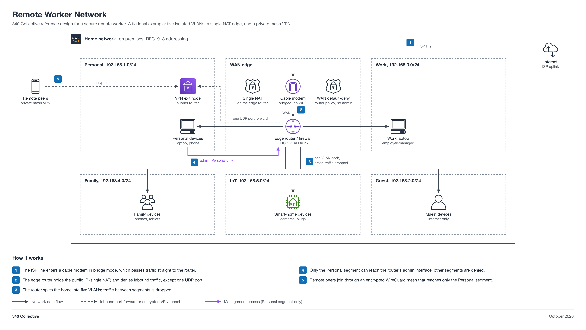

# Remote Worker Network

A reference design for a secure work-from-home network. It segments a single home internet connection into five isolated VLANs, puts the public IP behind a single NAT edge, and reaches home resources remotely over an encrypted private mesh VPN.

This is a fictional, vendor-neutral example. It shows roles and RFC1918 subnets only, with no device models, hardware identifiers, public addresses, hostnames, or credentials.



## The design at a glance

| Segment | Subnet | What lives here |
|---|---|---|
| Personal | 192.168.1.0/24 | Trusted personal devices and the VPN exit node / subnet router |
| Work | 192.168.3.0/24 | Employer-managed work laptop |
| Family | 192.168.4.0/24 | Household phones and tablets |
| IoT | 192.168.5.0/24 | Smart-home devices (cameras, plugs), internet only |
| Guest | 192.168.2.0/24 | Visitor devices, internet only |

## How it works

1. The ISP line enters a cable modem in bridge mode, which passes traffic straight to the router.
2. The edge router holds the public IP (single NAT) and denies inbound traffic, except one UDP port.
3. The router splits the network into five VLANs; traffic between segments is dropped.
4. Only the Personal segment can reach the router's admin interface; other segments are denied.
5. Remote peers join through an encrypted WireGuard mesh that reaches only the Personal segment.

## Why it matters

Segmentation limits blast radius. A compromised IoT camera or a guest's device cannot pivot to the work laptop or personal machines, because inter-VLAN forwarding is dropped at the router. The management plane is reachable only from the Personal segment, and the only intentional inbound path from the internet is a single UDP port forward to the VPN exit node. Remote access rides an encrypted mesh VPN rather than an exposed admin port.

## Rebuilding the diagram

The diagram is generated by a Python script using the official AWS architecture icon set, then rendered to PNG with `rsvg-convert`.

```sh
python3 -m venv venv
venv/bin/pip install diagrams==0.25.1
# requires rsvg-convert (e.g. brew install librsvg)
venv/bin/python assets/build_remote_worker_network.py out/remote-worker-network
```

It writes `remote-worker-network.svg` and a 2x `remote-worker-network.png`.
