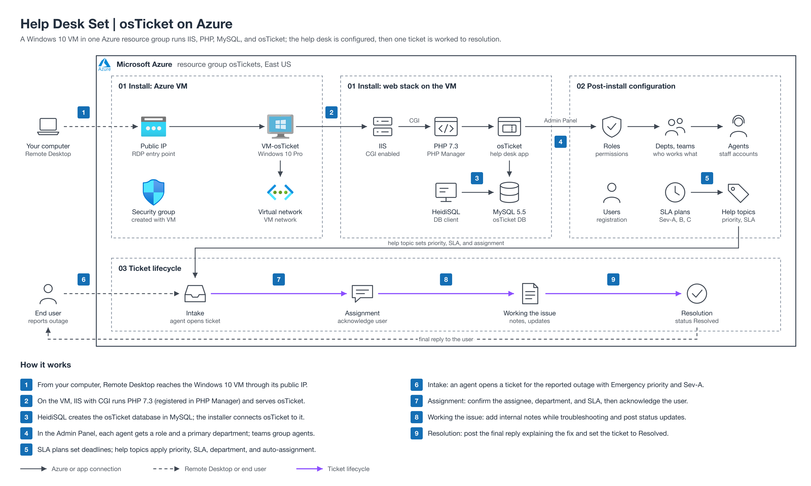

# Help Desk Set: osTicket (Help Desk Ticketing Systems)

Build a working help desk with osTicket on an Azure Windows VM: install it, configure it for real use, and then work a ticket from intake to resolution.

The diagram shows the Azure VM and web stack from section 01, the configuration from section 02, and the ticket lifecycle from section 03.

| Section | What you'll build | Folder |
|---|---|---|
| osTicket: Prerequisites and Installation | An Azure Windows 10 VM running IIS, PHP, MySQL, and a fresh osTicket install | [01-osticket-prerequisites-and-installation](01-osticket-prerequisites-and-installation/) |
| osTicket: Post-Installation Configuration | Roles, departments, teams, agents, users, SLAs, and help topics | [02-osticket-post-installation-configuration](02-osticket-post-installation-configuration/) |
| osTicket: Ticket Lifecycle Examples | One outage ticket worked from intake through resolution | [03-osticket-ticket-lifecycle-examples](03-osticket-ticket-lifecycle-examples/) |

## How to use

Each folder is a standalone follow-along guide with its own prerequisites, numbered steps, and expected results. Work them in order for the full build, or jump into any one on its own. Delete the Azure resource group when you finish to stop charges.
